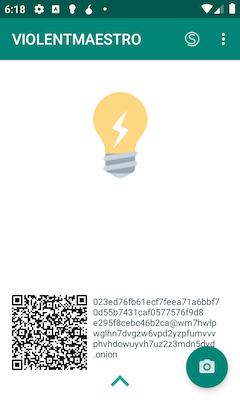
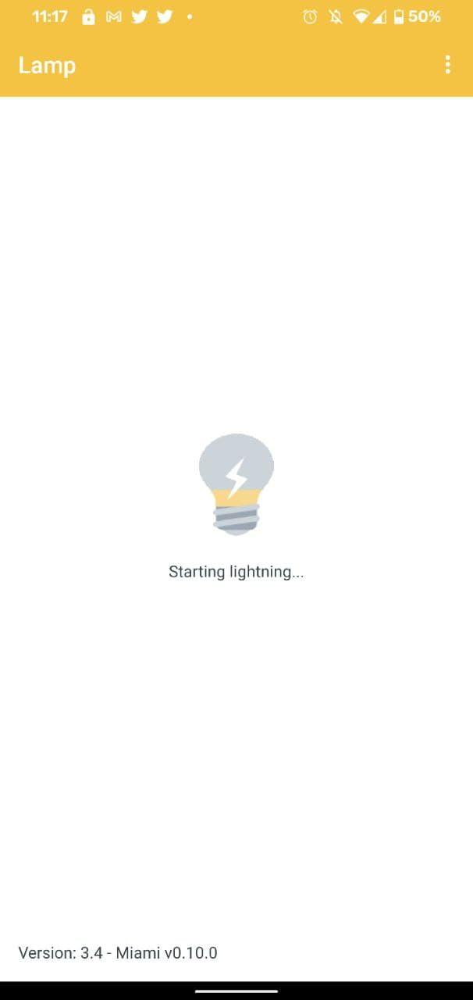
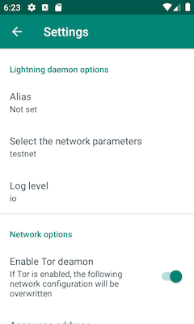

<div align="center">
  <h1>:bulb: Lamp :zap:</h1>

  

  <p>
    <strong> :bulb: <a href="https://github.com/ElementsProject/lightning">c-lightning</a> Android Mobile Porting :zap: </strong>
  </p>

  <p>
      <a href="https://github.com/clightning4j/lamp/actions">
        
      </a>  
      <a href="https://github.com/clightning4j/lamp/releases">
        
      </a>
      
      <a href="https://github.com/clightning4j/lamp/blob/master/LICENSE">
        
      </a>
  </p>

  <p>
    <a href="https://apt.izzysoft.de/fdroid/index/apk/com.lvaccaro.lamp">
        
      </a>
  </p>
</div>

## Table of Content

- Introduction
- How to Use
- Build
- How to Contribute
- References
- License

## Introduction

> This is an experimenting lightning wallet. Use it on testnet or only with amounts you can afford to lose on mainnet.

Touch the lamp to download and run c-lightning from cross-compiled binaries for Android are available [here](https://github.com/clightning4j/lightning_ndk/releases).

<span> 
    
    
    
</span>

## How to Use

### Bitcoin Setup

##### Automatic with esplora plugin

This is the default behaviour.

Lamp is using [the C Esplora plugin for C-lightning](https://github.com/clightning4j/esplora_clnd_plugin) as the Bitcoin backend of the lightning node (to fetch chain/blocks/transactions information and send transactions).

You can point it to your own [Esplora](github.com/Blockstream/esplora) instance in the settings, and it uses [blockstream.info](https://blockstream.info) by default.


##### Manually with bitcoind rpc node
On Lamp settings, disable Esplora plugin and set the current Bitcoin RPC options:

- Bitcoin RPC username
- Bitcoin RPC password
- Bitcoin RPC host (default 127.0.0.1)
- Bitcoin RPC port (default 18332 for testnet)

### Tor Setup

##### Automatic with internal tor service

Lamp is using tor hidden service as default. A new hidden service will be created at the first running time.

##### Manually with Orbot

Open [Orbot](https://github.com/guardianproject/Orbot) and setup a fixed tor address by menu: Onion Services -> Hosted Services -> set a service name and port 9735. Restarting tor to discover and copy the local address.

On Lamp settings, enable proxy using orbot localhost gateway:

- proxy: 127.0.0.1:9050
- announce address: tor_address
- bind address: 127.0.0.1:9735

Read the following instructions at [Tor on clightning](https://lightning.readthedocs.io/TOR.html) to setup address on different network scenario.

## Building

 * [in Linux using cmdline tools](doc/cmdline-tools-setup.md)

## How to Contribute

Just propose new stuff to add or bug fixing with a new PR.

### Code Style
[](https://ktlint.github.io/)

> We live in a world where robots can drive a car, so we shouldn't just write code, we should write elegant code.

This repository use [ktlint](https://github.com/pinterest/ktlint) to maintains the code of the repository elegant, so 
before submit the code check the Kotlin format with the following command on the root of the directory

```bash
./gradlew formatKotlin
```

## References

- [ABCore](https://github.com/greenaddress/abcore) Android Bitcoin Core wallet
- [bitcoin_ndk](https://github.com/greenaddress/bitcoin_ndk) ndk build of bitcoin core and knots
- [clightning_ndk](https://github.com/clightning4j/lightning_ndk) android cross-compilation of c-lightning for Android >= 24 Api
- [c-lightning](https://github.com/ElementsProject/lightning) Lightning Network implementation in C
- [esplora plugin](https://github.com/clightning4j/esplora_clnd_plugin) C-Lightning plugin for esplora

## License

<div align="center">
  
</div>

c-lightning Android Mobile Porting

Copyright (c) 2019-2021 Luca Vaccaro

This program is free software; you can redistribute it and/or modify
it under the terms of the GNU General Public License as published by
the Free Software Foundation; either version 2 of the License.

This program is distributed in the hope that it will be useful,
but WITHOUT ANY WARRANTY; without even the implied warranty of
MERCHANTABILITY or FITNESS FOR A PARTICULAR PURPOSE.  See the
GNU General Public License for more details.

You should have received a copy of the GNU General Public License along
with this program; if not, write to the Free Software Foundation, Inc.,
51 Franklin Street, Fifth Floor, Boston, MA 02110-1301 USA.
